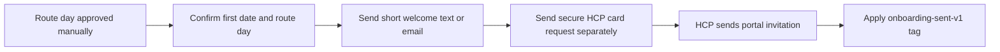

# Purge Pros new-customer onboarding guide

**Current as of:** August 9, 2026  
**Public guide URL:** `https://itspurgepros.com/welcome`  
**Use this process:** only after Purge Pros manually approves the route day and first service date

This package replaces one overloaded text with a short confirmation message, a polished public welcome page, and separate secure Housecall Pro messages. It does not replace Housecall Pro, change the quote funnel, collect card information, or require a complex nurture workflow.

## The promise customers should hear

- The customer has a regular route day, not a fixed appointment time.
- Purge Pros sends a reminder the night before.
- Purge Pros sends an en-route heads-up when the technician is generally **10–45 minutes away**.
- Do not call this an “exact ETA.” Traffic, weather, route workload, and access conditions can change the arrival window.
- The customer pays per visit.
- The card on file is charged when the en-route text is sent.
- The Housecall Pro card request and portal invitation arrive separately through secure channels.

## Recommended customer handoff



Keep this sequence human-controlled. Route approval is where the owner verifies capacity and decides the route day; automation should distribute consistent information only after that decision.

## Copy-and-paste text templates

The templates avoid emoji so the message is less likely to split into many UCS-2 SMS segments. Replace all bracketed fields before sending.

### 1. Route-confirmation text

```text
Purge Pros: You're confirmed for [FIRST DATE] on our [ROUTE DAY] route. Arrival times vary. We'll send a reminder the night before and an en-route text when we're generally 10-45 minutes away. What happens next: https://itspurgepros.com/welcome
```

This is the main customer-facing confirmation. It communicates the date, prevents a fixed-time expectation, and moves the detailed explanation to an owned Purge Pros page.

### 2. Secure card-request text

Send this as a separate message with the customer-specific Housecall Pro secure link:

```text
Purge Pros payment setup: Please add your card securely before the first visit: [SECURE HCP LINK]

Your card is charged per visit when the en-route text is sent. There is no monthly bill.
```

Never paste the secure Housecall Pro link into the public welcome page, a website button, a CRM note visible to unrelated contacts, or GitHub.

### 3. Portal follow-up text, only if needed

```text
Your Housecall Pro customer portal invitation was sent separately by email. Please check spam or promotions if it is not in your main inbox. The portal contains your available appointments, invoices, receipts, and account records.
```

Do not send this automatically if Housecall Pro has not actually issued the invitation.

### 4. Route-change clarification

```text
Your regular service day is [ROUTE DAY], but it is not a fixed appointment time. We'll remind you the night before and text when we're en route, generally 10-45 minutes before arrival. If weather or the route changes, we'll send an update.
```

## Copy-and-paste email

**Subject:** You're on the Purge Pros route — here's what happens next

```text
Hi [FIRST NAME],

You're confirmed for [FIRST DATE] on our [ROUTE DAY] route.

Arrival times vary, but we'll send a reminder the night before and an en-route text when we're generally 10-45 minutes away.

Please review the quick new-customer guide:
https://itspurgepros.com/welcome

Your secure Housecall Pro card request and customer portal invitation arrive separately. Please complete the card request before your first visit and check spam or promotions if the portal email is not in your main inbox.

Thank you,
Purge Pros
(317) 961-5865
```

Use this when email is the customer's selected contact method or when the closing conversation happened by email. Do not automatically send service texts to a customer who did not consent to SMS.

## Phone-close script

```text
You're confirmed for [FIRST DATE] on our [ROUTE DAY] route. The route day is consistent, but it isn't a fixed appointment time. We'll remind you the night before and text when we're en route, generally 10 to 45 minutes before arrival. I'll send the welcome guide now, followed separately by your secure Housecall Pro card request.
```

After the call, send the welcome page through the customer's permitted contact channel so they have a durable reference.

## Build the public `/welcome` page in GoHighLevel

1. Open the Purge Pros website in **Sites → Websites**.
2. Add a new page named **New Customer Welcome**.
3. Set the page path to `/welcome`.
4. Use the same global header and footer as the current website.
5. Between the header and footer, add one full-width section and one full-width row.
6. Set the section and row padding to `0` so GoHighLevel does not add a white border around the widget.
7. Add a **Custom Code** element inside the row.
8. Open `onboarding/pp-new-customer-welcome-widget.html` from this repository.
9. Copy the entire file and paste it unchanged into the Custom Code element.
10. Save and preview the page on desktop and mobile.
11. In the page SEO settings, use:
    - Page title: `New Customer Welcome | Purge Pros`
    - Meta description: `What new Purge Pros customers can expect before, during, and after pet waste removal service.`
    - Search indexing: off, if GoHighLevel exposes this toggle.
12. Keep the page as `noindex,follow`. The widget also adds this directive as a safeguard, but the GoHighLevel page setting is preferred.
13. Publish the page and confirm `https://itspurgepros.com/welcome` loads without login.
14. Test the **Text us** and **Call** buttons on a phone.

### Why the page is noindex

The page is designed for already-approved customers, not search traffic. `noindex,follow` prevents a thin operational page from competing with service and city pages while allowing its normal site links to be followed.

### What must never be added to the public page

- A universal Housecall Pro card link
- Customer names, addresses, appointment dates, gate codes, or pet notes
- Card fields or a custom payment form
- GHL webhook URLs, Cloudflare secrets, API keys, or tracking tokens
- A `Lead`, `Purchase`, or service-request conversion event

Ordinary page-view analytics are fine. This page represents onboarding after a manual route approval, not a new advertising conversion.

## Simple GoHighLevel implementation

Do not create a new pipeline or rebuild the quote workflow for this onboarding page.

### Recommended manual control point

When the route and first date are approved:

1. Update the opportunity to the existing **Booked** stage.
2. Confirm the first service date and route day in the contact/opportunity record.
3. Send the route-confirmation template through the customer's permitted channel.
4. Send the customer-specific Housecall Pro secure card request separately.
5. Confirm that Housecall Pro issued the portal invitation.
6. Apply the GHL tag `onboarding-sent-v1`.
7. Add an internal note if card setup or access information is still outstanding.

The tag is an audit marker, not a trigger for promotional messaging.

### Optional one-workflow version

Only use this after the manual process has been tested on several real customers.

- Workflow name: `Booked - New Customer Welcome v1`
- Trigger: opportunity moved to **Booked** in the active Purge Pros quote pipeline
- Filter: contact does not have `onboarding-sent-v1`
- If/Else branch: preferred contact method
  - Text: send the route-confirmation SMS only if service SMS consent is present and SMS DND is off.
  - Email: send the onboarding email only if email is present and email DND is off.
  - Phone: create a manual-call task using the phone-close script.
  - Invalid/missing: send an internal alert and stop.
- Final action after a successful customer message: add `onboarding-sent-v1`.

Keep the secure Housecall Pro card request outside this generic workflow because the link is customer-specific and should remain in Housecall Pro's secure delivery process.

### Workflow settings

- Allow re-entry: off
- Stop on response: off for this single confirmation workflow; it has no nurture sequence to stop
- Multiple opportunities: keep the existing pipeline policy; the onboarding tag prevents duplicate sends to the same contact
- Sending window: immediate is appropriate after the customer has just approved a route, but use manual review if the approval is being processed at an unusually late hour

## Before publishing: acceptance test

- [ ] The page says the en-route notice is generally 10–45 minutes before arrival.
- [ ] The page never promises an exact ETA or fixed appointment time.
- [ ] Billing says per visit and charged when the en-route message is sent.
- [ ] The public page contains no customer or payment data.
- [ ] The secure Housecall Pro message is sent separately.
- [ ] The portal invitation is confirmed before telling the customer it was sent.
- [ ] Text customers have service SMS consent and SMS DND is off.
- [ ] Email customers have an address and email DND is off.
- [ ] The page is `noindex,follow`.
- [ ] No advertising conversion fires on `/welcome`.
- [ ] Both contact buttons work on mobile.

## Recommended real-customer rollout

Use the manual sequence for the first five customers. Note every follow-up question they ask. If the same question appears at least twice, improve the public guide before adding more automation. The goal is fewer questions and clearer expectations, not a longer workflow.
